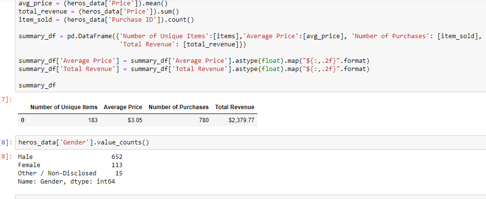

# Heros-of-pymoli-pandas
Report includes the following:

Player Count
Total Number of Players
Purchasing Analysis (Total)
Number of Unique Items
Average Purchase Price
Total Number of Purchases
Total Revenue
Gender Demographics

Percentage and Count of Male Players
Percentage and Count of Female Players
Percentage and Count of Other / Non-Disclosed
Purchasing Analysis (Gender)

The below is broken down by gender:

Purchase Count
Average Purchase Price
Total Purchase Value
Average Purchase Total 

Age Demographics
The below each broken into bins of 4 years (i.e. <10, 10-14, 15-19, >20)

Purchase Count
Average Purchase Price
Total Purchase Value
Average Purchase Total 

Identified the the top 5 spenders in the game by total purchase value, then list (in each table):

SN
Purchase Count
Average Purchase Price
Total Purchase Value

Most Popular Items
Identified the 5 most popular items by purchase count, then list (in a table):

Item ID
Item Name
Purchase Count
Item Price
Total Purchase Value

Most Profitable Items
Identified the 5 most profitable items by total purchase value, then list (in a table):

Item ID
Item Name
Purchase Count
Item Price
Total Purchase Value
